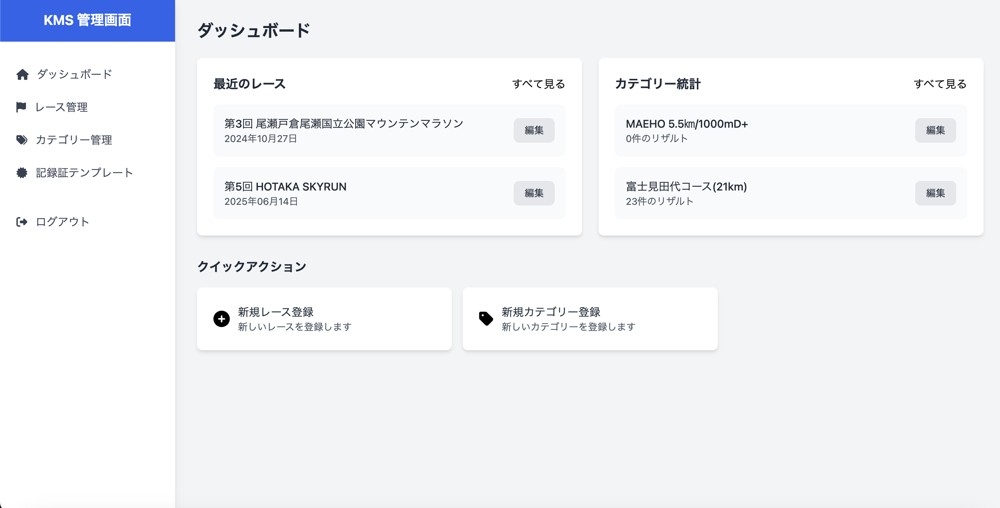
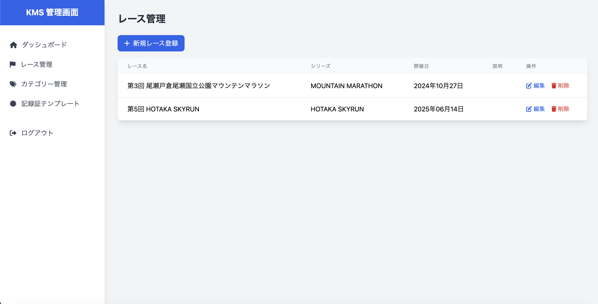
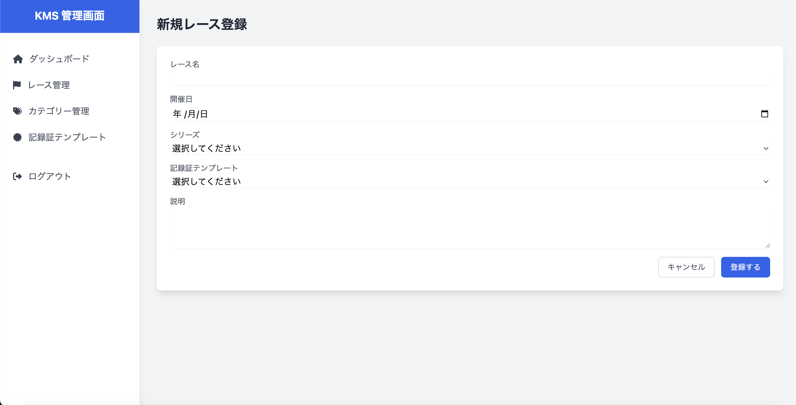
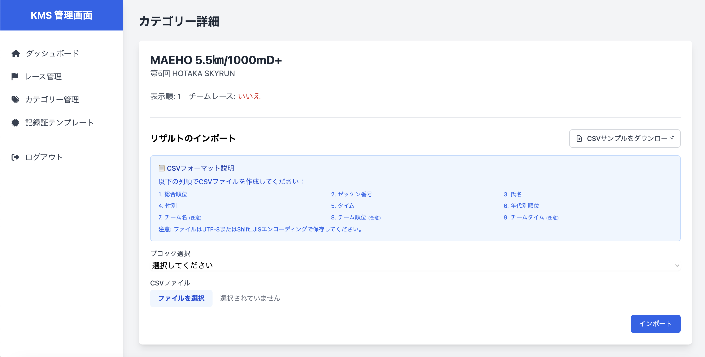
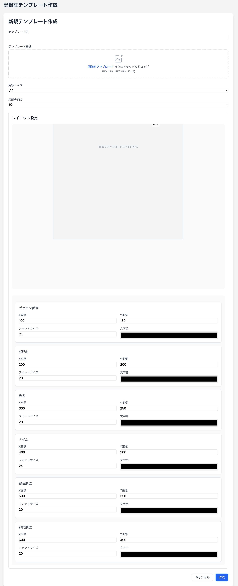

# WEB記録証システム

## 概要
Katashina Mountains Series（片品山岳シリーズ）のスカイランニングレースで使用するWEB記録証をダウンロードできるシステムです。選手は自身のレース記録をPDF形式でダウンロードすることができます。

## 主な機能
- レース記録証のPDFダウンロード
- レース結果の管理
- カテゴリー別の記録管理
- 記録証テンプレートの管理

## 技術スタック
### バックエンド
- PHP 8.2
- Laravel 11.9
- MySQL

### フロントエンド
- Alpine.js
- TailwindCSS
- Bootstrap 5

### その他の主要パッケージ
- barryvdh/laravel-dompdf: PDF生成
- intervention/image: 画像処理
- maatwebsite/excel: Excel/CSVファイル処理

## 管理画面機能
管理画面では以下の機能を提供しています：

### ダッシュボード

- レース情報の概要
- 最新の記録証ダウンロード状況

### レース管理

- レースの作成・編集・削除
- 参加者データの一括インポート
- レース結果の管理

### カテゴリー管理

- カテゴリー別の記録管理
- 順位の自動計算

### 記録証テンプレート管理

- 記録証デザインのカスタマイズ
- テンプレートの作成・編集